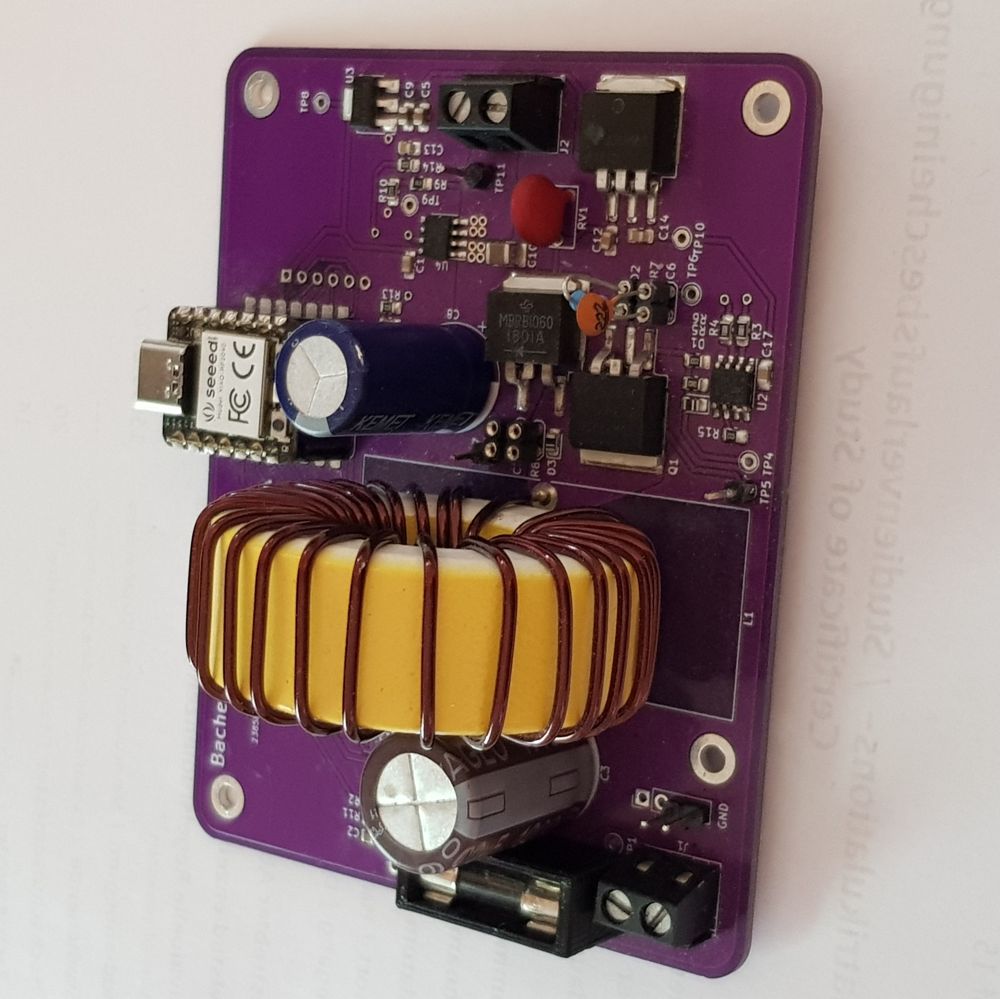

# Mushroom MPPT Controller
The mushroom controller, is a micropython powered mppt solar optimizer to investigate different algorithms.

You can find a great overview of the project on this [slides](https://dulouie.github.io/mushroom_mppt/).
