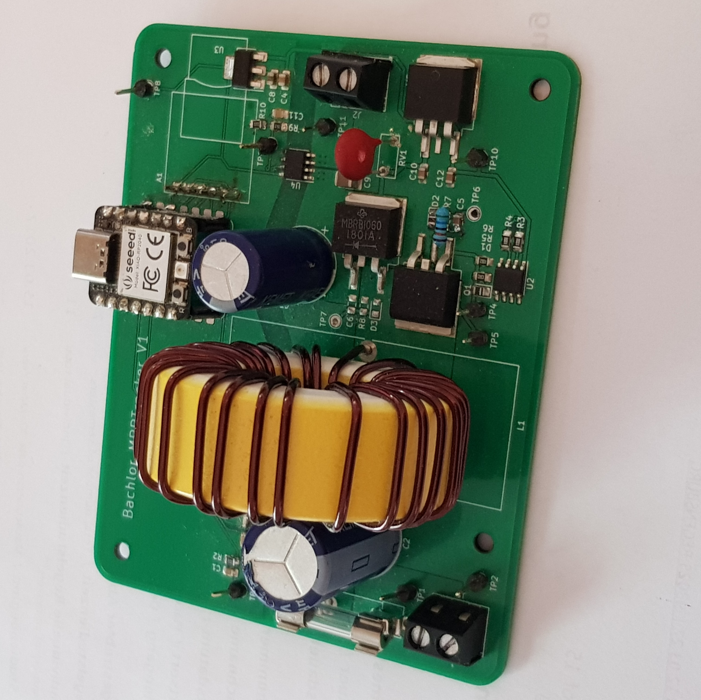

## Bachelorarbeit 

### Solarmoduloptimierer
Arne Schmidt
---
## Gliederung

- Idee & Motivation
- Konzept
- Implementierung
- Algorithmen
- Praktischer Versuch
    - PV-Emulator
    - Ergebnisse
- Fazit

---

## Idee & Motivation

Balkonkraftwerk

Mikrowechselrichter

MPP-Tracker

frei programmierbar?

---

## Idee & Motivation

closed source

Eigenentwicklung

Mikrocontroller

Mircopython

Leistungselektronik

Solarmoduloptimierer

---

## Ziel

* frei programmierbarer MPP-Tracker
* Plattform für einfache Entwicklung mit Micropython
* Untersuchung verschiedener MPPT-Algorithmen
* Machbarkeit untersuchen